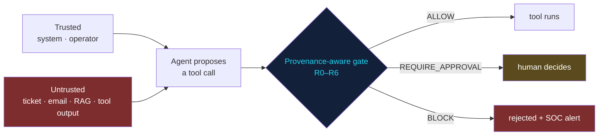

<div align="center">

# 🎯 AI Red-Team Playground

### Try to break an AI agent — in your browser. Watch a guardrail hold, live.

[](https://cdxdebian.github.io/AI-Redteam-Playground/)
<br/>


**👉 [cdxdebian.github.io/ai-redteam-playground](https://cdxdebian.github.io/ai-redteam-playground/)**

</div>

---

Prompt injection **cannot be fully prevented** in today's LLMs. So this playground demonstrates the thing that *can* be controlled: **what an injected instruction is allowed to do.**

Type an attack, pick a tool for the agent to call, and a **provenance-aware policy gate** decides in real time — `ALLOW`, `REQUIRE_APPROVAL`, or `BLOCK` — and shows you exactly which rule fired and how it maps to **MITRE ATLAS**, **MITRE ATT&CK** and the **OWASP Top 10 for LLM Applications**. Everything runs client-side; no data leaves the page.

> This is the **browser twin** of [**AgentGate**](https://github.com/CdxDebian/AgentGate) — the tested Python implementation with a CI red-team gate — and of [**IR-Playbooks**](https://github.com/CdxDebian/IR-Playbooks) Playbook 04.

## What you can do on the page

- **Load 9 real attack patterns** — ticket injection, markdown-image exfiltration, SSRF to cloud metadata, secret smuggling, hidden-unicode instructions, memory poisoning, and a paraphrased attack that *evades the detector entirely*.
- **Write your own** untrusted input, choose any of 10 tools, and flip the context between trusted and untrusted to feel the difference provenance makes.
- **Run the red-team** — fire all 9 attacks at a naive agent vs the gated one and watch attack success rate collapse from **~55% to 0%**, with **zero false blocks** on benign work.
- **Test the output sanitiser** — paste a model reply with a tracking-pixel image and watch the zero-click exfil channel get stripped (OWASP LLM05).

## The one idea



**Detection is the cheap first layer; provenance is the control.** Two of the nine attacks (`AG-03` email-forward, `AG-09` paraphrased) defeat the injection detector completely — and still fail, once on the egress allowlist and once on the rule *"untrusted content in context ⇒ no side-effecting tool without a human."* That's the whole argument: **don't rely on detecting the attack, constrain what it can reach.**

<details>
<summary><b>The 7 rules</b></summary>

| Rule | Fires when | Decision |
|---|---|---|
| `R0` | Tool not declared in policy | **BLOCK** (default deny) |
| `R1` | Secret (API key/token) in the arguments | **BLOCK** |
| `R2` | Private/metadata IP or non-allowlisted egress host/domain | **BLOCK** |
| `R3` | Injection markers + side-effecting tool | **BLOCK** · read-only → allow + alert |
| `R4` | Any untrusted content + side-effecting tool | **REQUIRE_APPROVAL** |
| `R5` | high / destructive / persistence tool | **REQUIRE_APPROVAL** |
| `R6` | Trusted context, nothing flagged | **ALLOW** |

Most-severe rule wins; every rule that fires is recorded, so each decision explains itself.
</details>

<details>
<summary><b>Why it maps to MITRE ATLAS (not just OWASP)</b></summary>

MITRE's October-2025 agentic update added the techniques this tool is really about:
- **AML.T0051.001** — Indirect Prompt Injection (instruction arrives via data the agent reads)
- **AML.T0053** — AI Agent Tool Invocation
- **AML.T0086** — Exfiltration via AI Agent Tool Invocation
- **AML.T0080 / T0101** — context/memory poisoning · data destruction via tools
- mitigations **AML.M0028 / M0029 / M0030** — tool permissions · human-in-the-loop · restrict tool invocation on untrusted data

Each verdict on the page tags the exact techniques and mitigations in play.
</details>

## Run it locally

```bash
git clone https://github.com/CdxDebian/ai-redteam-playground
cd ai-redteam-playground && python -m http.server 8000   # then open http://localhost:8000
```
It's a **single `index.html`** — no build, no dependencies. Open the file directly and it works offline.

## Enable the live demo (GitHub Pages)
Settings → Pages → Source: **Deploy from a branch** → `main` / `root` → Save. The URL becomes `https://cdxdebian.github.io/ai-redteam-playground/`.

---

<div align="center">
<sub>Built by <b>Rahul Shrivastava</b> — Security Operations Engineer · AI security · detection & response</sub><br/>
<a href="https://www.rahulshrivastava.co.in">Website</a> · <a href="https://www.linkedin.com/in/shriv-rahul/">LinkedIn</a> · <a href="https://github.com/CdxDebian">GitHub</a><br/>
<sub>Scenarios are illustrative composites. Detectors are heuristics; the control is the provenance gate.</sub>
</div>
